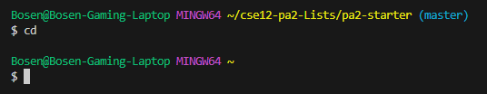
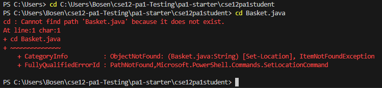
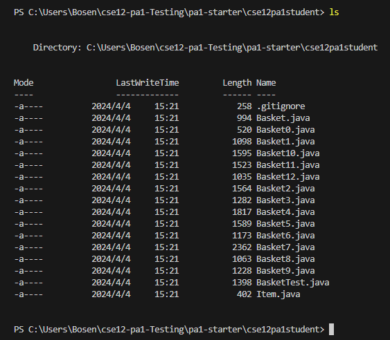
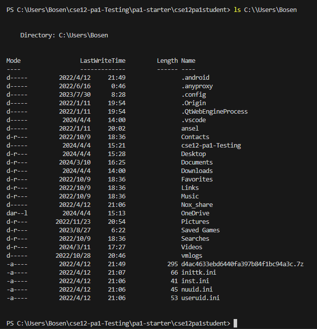
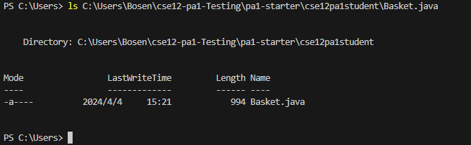
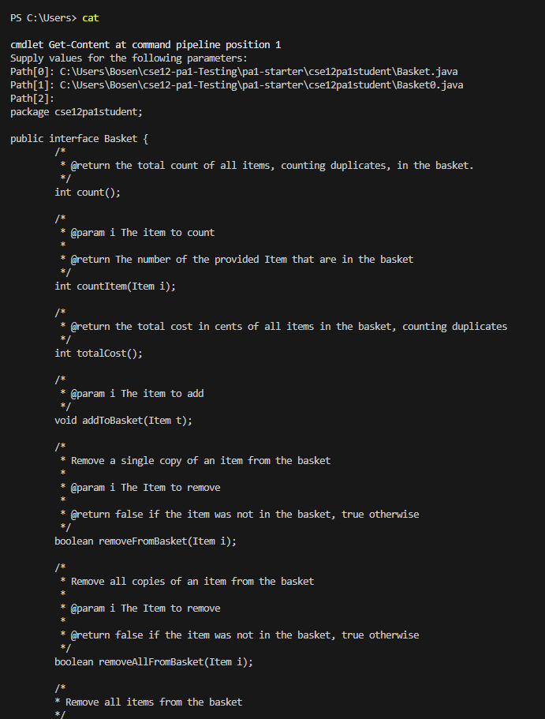
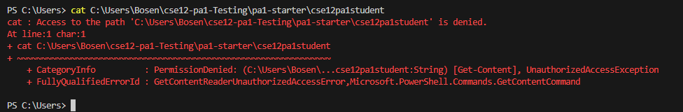
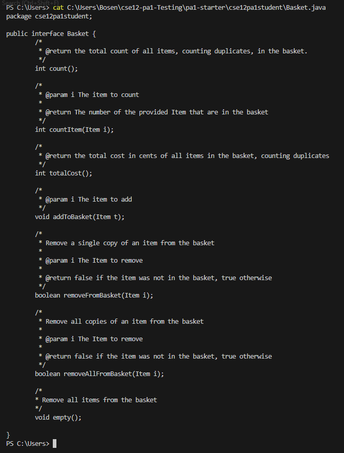

Command `cd`
-----------

- **using `cd` with no arguments.**

  
  

  **Absolute Path:** `C:\Users\Bosen`

  **Result Explanation:** If we are in the home directory and input `cd` with no argument, it does not generate an output, and our current working directory does not change.

  However, when we are not currently in the home directory and input `cd` with no argument, it will change the current working directory back to the home directory.

  **Does this run into error?** No, it does not run into error.

  

- **using `cd` with a path to a *directory* as an argument**

  

  **Absolute Path:** before the code run: `C:\Users\Bosen`, after the code run:  `C:\Users\Bosen\OneDrive`

  **Result Explanation:** `cd` stands for "changing directory" which is used switch working directory given a path. If we input `cd` with a path for a directory as argument, it does not generate an output, but take an absolute path or a legitimate relative path and bring us to the corresponding working directory.
  
  **Does this run into error?** No, it does not run into error.

  

- **using `cd` with a path to a *file* as an argument**

  

  **Absolute Path:** `C:\Users\Bosen\cse12-pa1-Testing\pa1-starter\cse12pa1student`

  **Result Explanation:** If we input `cd` with a path of file as argument, like currently I am at `C:\Users\Bosen\cse12-pa1-Testing\pa1-starter\cse12pa1student` directory and inputed relative path for `Basket.java`. This runs into an error because Basket.java is not a directory.

  **Does this run into error?** Yes, it runs into error. The reason is `cd` takes only the path for a directory and make that one current working directory. If we input the path for a file, this would run into error.
  
Command `ls`
----------

- **using `ls` with no arguments.**

  

  **Absolute Path:** `C:\Users\Bosen\cse12-pa1-Testing\pa1-starter\cse12pa1student`

  **Result Explanation:** `ls` stands for "list" which lists files and folders of a give path. If we input `ls` with no argument, it lists all files and folders in our current working directory.

  **Does this run into error?** No, it does not run into error.

  

- **using `ls` with a path to a *directory* as an argument**

  

  **Absolute Path:** `C:\Users\Bosen\cse12-pa1-Testing\pa1-starter\cse12pa1student`

  **Result Explanation:** If we input `ls` with the path of a directory, it lists all files and folders in the inputed directory. However, this command does not change the current working directory.

  **Does this run into error?** No, it does not run into error.

  

- **using `ls` with a path to a *file* as an argument**

  

  **Absolute Path:**  `C:\Users`

  **Result Explanation:** If we input `ls` with the path of a file, it lists the information about that file. However, this command does not change the current working directory.

  **Does this run into error?** No, it does not run into error.
  
Command `cat`
-----------

- **using `cat` with no arguments.**

  

  **Absolute Path:** `C:\Users\Bosen\cse12-pa1-Testing\pa1-starter\cse12pa1student`

  **Result Explanation:** `cat` stands for "concatenate" that prints the contents in one or more files in the given path. If we input `cat` with no argument, it asks user to offer paths for files and prints contents in those files from the given paths.

  **Does this run into error?** No, it dooes not run into error.

  

- **using `cat` with a path to a *directory* as an argument**

  

  **Absolute Path:** `C:\Users\Bosen\cse12-pa1-Testing\pa1-starter\cse12pa1student`

  **Result Explanation:**  If we input `cat` with the path of a directory, it will run into an error.

  **Does this run into error?** Yes, this has run into error. `cat` command takes one or multiple paths for only files. 

  

- **using `cat` with a path to a *file* as an argument**

  

  **Absolute Path:** `C:\Users`

  **Result Explanation:** If we input `cat` with a path of a file, it will prints all contents in that file. Alternatively, we can also offer more than one paths of files so that it will prints all contents in those files together.

  **Does this run into error?** No, it dooes not run into error.

