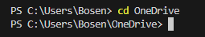

[cse15l-lab-report-1](https://github.com/BosenSD/cse15l-lab-reports.git)
=============
Command `cd`
----------

- **using `cd` with no arguments.**

  

  **Absolute Path:** `C:\Users\Bosen`

  **Result Explanation:** If we input `cd` with no argument, it does not generate an output, and our current working directory does not change because we do not input an argument after `cd`

  **Does this run into error?** No, it does not run into error.

- **using `cd` with a path to a *directory* as an argument**

  

  **Absolute Path:** `C:\Users\Bosen\OneDrive`

  **Result Explanation:** `cd` stands for "changing directory" which is used switch working directory given a path. If we input `cd` with a path for a directory as argument, it does not generate an output, but take an absolute path or a legitimate relative path and bring us to the corresponding working directory.
  
  **Does this run into error?** No, it does not run into error.

- **using `cd` with a path to a *file* as an argument**

  

  **Absolute Path:** `C:\Users\Bosen\cse12-pa1-Testing\pa1-starter\cse12pa1student`

  **Result Explanation:** If we input `cd` with a path as argument, like currently I am at `C:\Users\Bosen\cse12-pa1-Testing\pa1-starter\cse12pa1student` directory and inputed relative path for `Basket.java`. This runs into an error because Basket.java is not a directory.

  **Does this run into error?** Yes, it runs into error. The reason is `cd` takes only the path for a directory and make that one current working directory. If we input the path for a file, this would run into error.
  
Command `ls`
----------

- **using `ls` with no arguments.**

  

  **Absolute Path:** `C:\Users\Bosen\cse12-pa1-Testing\pa1-starter\cse12pa1student`

  **Result Explanation:** `ls` stands for "list" which lists files and folders of a give path. If 

- **using `cd` with a path to a *directory* as an argument**

- **using `cd` with a path to a *file* as an argument**

`ls` stands for "list" which lists files and folders of a give path, 

Command cat
-----------

Share an example of using the command with no arguments.
Share an example of using the command with a path to a directory as an argument.
Share an example of using the command with a path to a file as an argument.
